********
=
# Spring 2018 CS543:  Assignment 1  
**Name**: Ziyu Zhou  
**NetID**: ziyuz2

=
********

## 1 Basic Implementation Solutions


The solution is implemented in Python. There are two main libraries used in this solution:

* Numpy: To manipulate the image matrices
* Matplotlib: To process and display images.


### 1.1 Preprocess Data

This part is implemented in fucntion `preprocess()`. There are three steps:

```
Subtract ambient image.
Set negative pixel value to zero.
Rescale.
```

For the first setp, `np.newaxis` is used to extend the dimension of `ambient_image` along `axis = 2` such that its dimension can match `imarray`'s.

For the second step, the method is 

```python
processed_imarray[processed_imarray < 0] = 0
```
which utilizes the boolean indexes provided by `[processed_imarray < 0]` to directly set all values in `processed_imarray` smaller than zero to zero without any loops.


### 1.2 Estimate Albedo and Surface Normals

This part is implemented in function `photometric_stereo()`. The basic steps are:

```
Obtain image dimensions h, q, n_images, n_pix.
Reshape imarray (h, w, n_images) to (n_images, n_pix).
Solve linear system to obtain g (3, n_pix).
Solve albedo and normal.
Reshape surface_normals and albedo_image.
```

In the third step, array `g` is the product of surface normal and albedo, which is solved by `np.linalg.lstsq()` as follows.

```python
results = np.linalg.lstsq(light_dirs, imarray)
g = results[0]
```

`reshape` and `transpose` have been used before and after passing the arrays to `np.linalg.lstsq()` to make the dimensions correct.


### 1.3 Compute Surface Height Map 

This part is implemented in function `get_surface`. The basic steps are:

```
Compute partial derivative fx and fy.
Implement helper functions for four kinds of integration methods.
Compute height map and record running time.
```

The helper functions and algorithms for the four integration methods are disscussed below.

#### 1.3.1 Integrating first the rows, then the columns
The function for this method is `row()`.

```python
def row():
    return row_sum_x[0] + col_sum_y
```

Note that the rows of the array represent for the `x` axis, and the columns represent for the `y`axis. `row_sum_x` and `col_sum_y` are cumulative sums along the `x` axis and `y` axis obtained by `np.cumsum()`.

#### 1.3.2 Integrating first along the columns, then the rows
The function for this method is `column()`.

```python
def column():
    return col_sum_y[:, 0][:, np.newaxis] + row_sum_x
```

#### 1.3.3 Average of the first two options
The function for this method is `average()`. It's basically taking the average over the results obtained from `row()` and `column()` functions.

```python
def column():
    return col_sum_y[:, 0][:, np.newaxis] + row_sum_x
```

#### 1.3.4 Average of multiple random paths
The function for this method is `random()`. Through experiments, the number of paths is selected to be **25** considering performance and running time.

##### 1.3.4.1 Generate random paths

To avoid excessive computations, the random paths generated here are sudo random paths, which can only go right and down with corresponding displacements no greater than the coordinates of the pixel at the destination.

The idea of generating such random paths is illustrated below.

```
Flipping coins to generate random paths.
Only allow moving right and down, representing as follows:

         coin  direction  height
            0      right     +fx
            1       down     +fy
```

Let the coordinate of the pixel at the destination be `(x, y)`, the constraint that the displacements of the path cannot exceed this coordinate can be express as `number of zeros <= x` and `number of ones <= y`. To make sure that the path can actually arrive pixel `(x, y)`, the inequality above becomes equality (`#zeros = x` and `#ones = y`).

The method of enforcing this constraint in the process of flipping coins to generate random paths is shown below.

```python
# Enforce contraints.
zeros = [0] * x
ones = [1] * y
coins = np.array(zeros + ones)
# Randomize the path.
np.random.shuffle(coins)
```

##### 1.3.4.2 Overall algorithm

The overall algorithm for function `random()` is

```
Algorithm:
For each pixel(x, y) except the starting point(0, 0)
     For each path
         Flip coins of length x+y
         Move according to coins until reach (x, y)
         Add the cumsum along the path to height
     Take average over paths
```

<div style="page-break-after: always;"></div>

## 2 Discussion on Different Integration Methods

This discussion is based on subject `yaleB01`. The following table shows the surface height maps and the corresponding running time for the above four integration methods (`column`, `row`, `average` and `random`).


|         |                                                Surface Height Map (Viewpoint 1)                                                |                                                Surface Height Map (Viewpoint 2)                                                | Running Time |
|:-------:|:------------------------------------------------------------------------------------------------------------------------------:|:------------------------------------------------------------------------------------------------------------------------------:|:------------:|
|  Column |  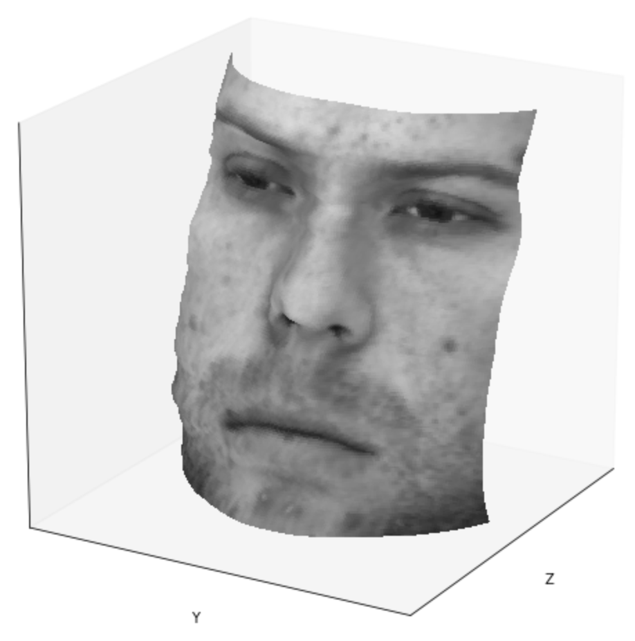 |  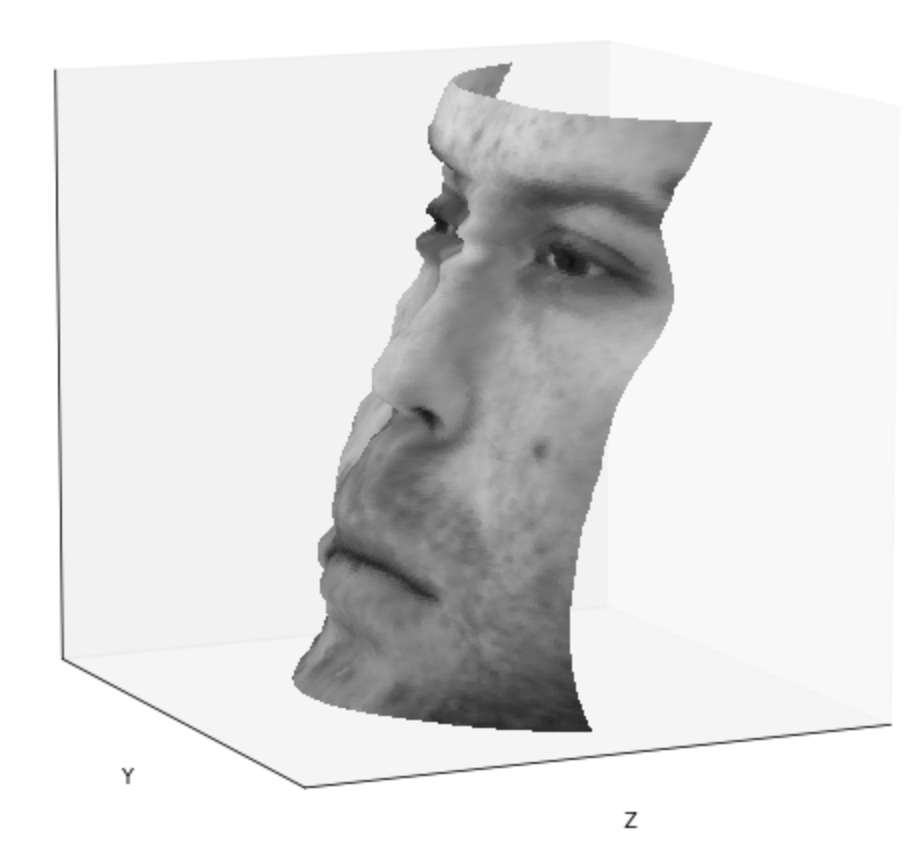 |   0.000466s  |
|   Row   |   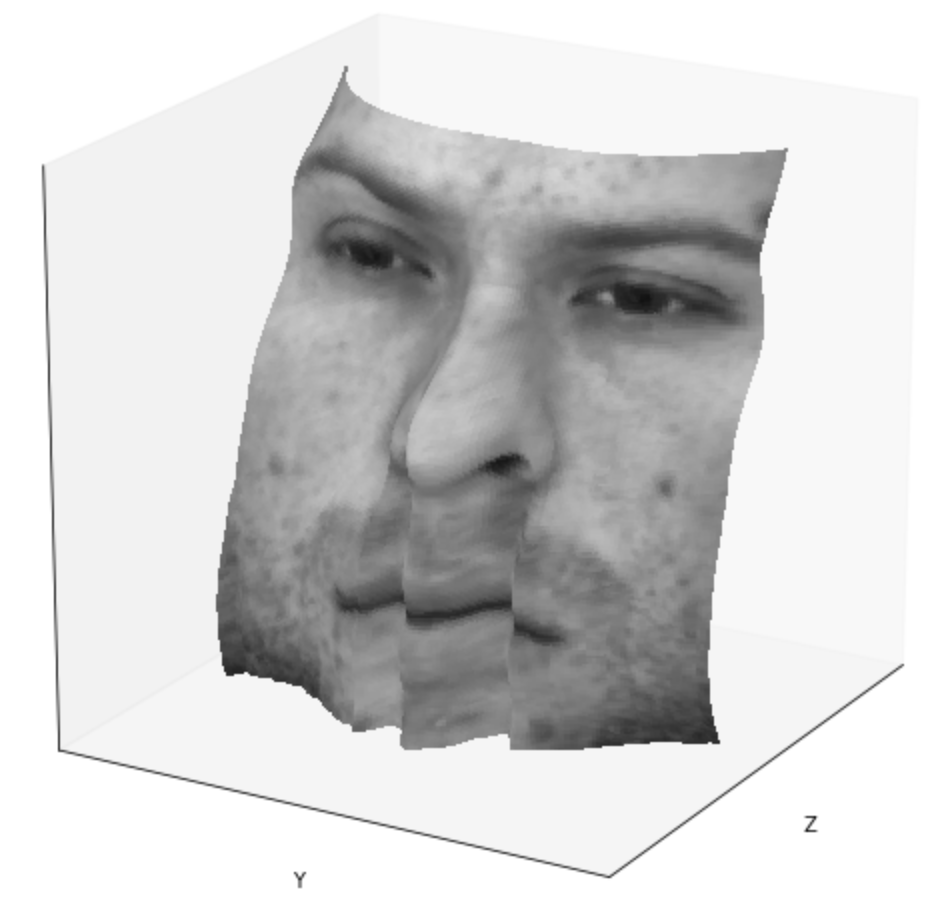   |   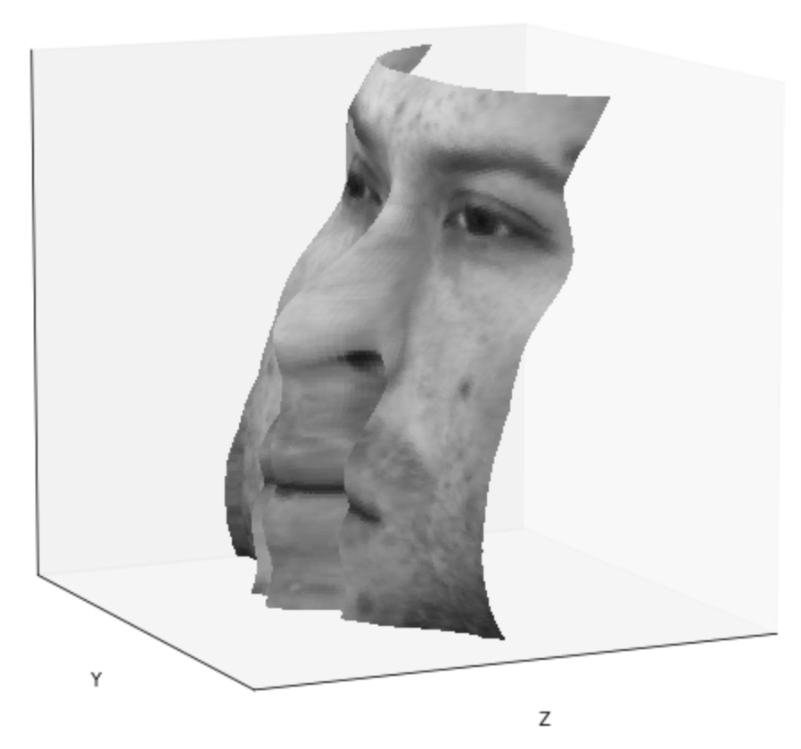   |   0.002343s  |

(Table continues below)

|         |                                                Surface Height Map (Viewpoint 1)                                                |                                                Surface Height Map (Viewpoint 2)                                                | Running Time |
|:-------:|:------------------------------------------------------------------------------------------------------------------------------:|:------------------------------------------------------------------------------------------------------------------------------:|:------------:|
| Average | 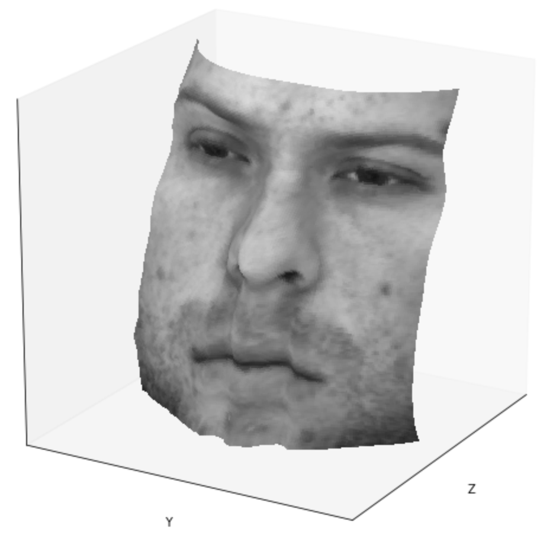 | 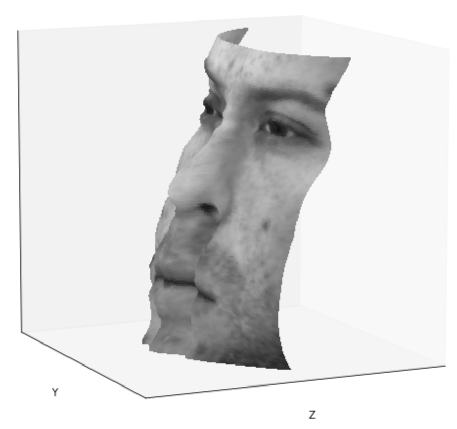 |   0.002197s  |
|  Random |   |  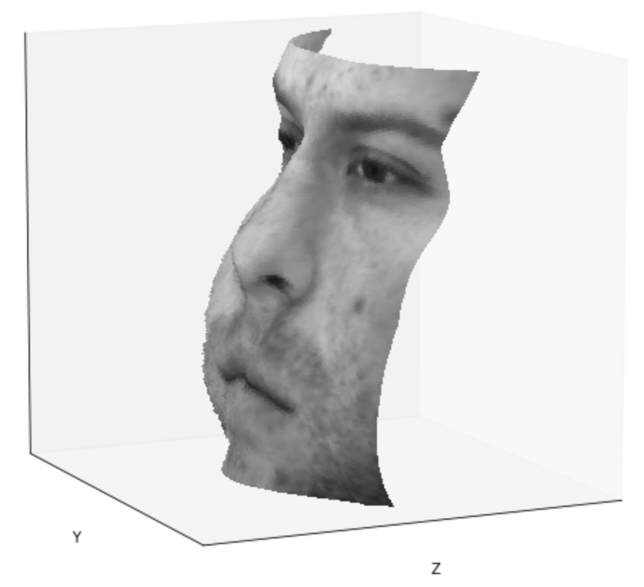 |  105.585 s  |


### 2.1 Qualities of the Outputs 
For the `column` Method (see section _1.3.2 Integrating first along the columns, then the rows_), there are some zig-zags on the person's nose. Some height information along the `y` axis might be lost.

For the `row` method (see section _1.3.1 Integrating first the rows, then the columns_), the output is not desirable. The zig-zag effect is very severe on the person's mouth and chin. The nose is also very strange. A possible reason is that the mouth and chin are on the most bottom part of the image, and thus are very far away from the first row, losing much information along their corresponding `x` axis.

The `average` method (see section _1.3.3 Average of the first two options_) looks better than the `column` and `row` methods, but the artifacts caused by the `row` method is so severe which reduces the overall quality of the output.

The `random` method clearly produces the **BEST** result. There is no artifact on the nose nor the mouth. This is because of the way that the random paths are generated. Compared to the `row` method which only includes the height information in the first row along `x` axis, the `random` method randomly includes the information of each row above the destination. This reason also applied when compared to the `column` method.


### 2.2 Running time

From the table above, the `column` runs the fastest. The `row` and `average` methods take almost the same time. However, the `random` method is much slower compared to the others. This is because `random` method requires three nested loops going through each pixel and each path, while the others don't need any loops.


## 3 Outputs for Each Subject

### 3.1 yaleB01

See section 2 for detailed discussion.


|                         |                                                                                                                                        Outputs                                                                                                                                       |
|:-----------------------:|:------------------------------------------------------------------------------------------------------------------------------------------------------------------------------------------------------------------------------------------------------------------------------------:|
|      Surface <br> Normal     |  <br>   |
|        Albedo <br> Map       |                                                                                                                                                            |
| Best <br> Height <br> Map |                                                                                                                                                       |


<div style="page-break-after: always;"></div>

### 3.2 yaleB02

The surface height map looks quite reasonable, but there are still some artifacts on the person's mouth.

|                         |                                                                                                                                        Outputs                                                                                                                                       |
|:-----------------------:|:------------------------------------------------------------------------------------------------------------------------------------------------------------------------------------------------------------------------------------------------------------------------------------:|
|      Surface <br> Normal     |  <br>   |
|        Albedo <br> Map       |                                                                                                                                                             |
| Best Surface <br> Height Map |                                                                            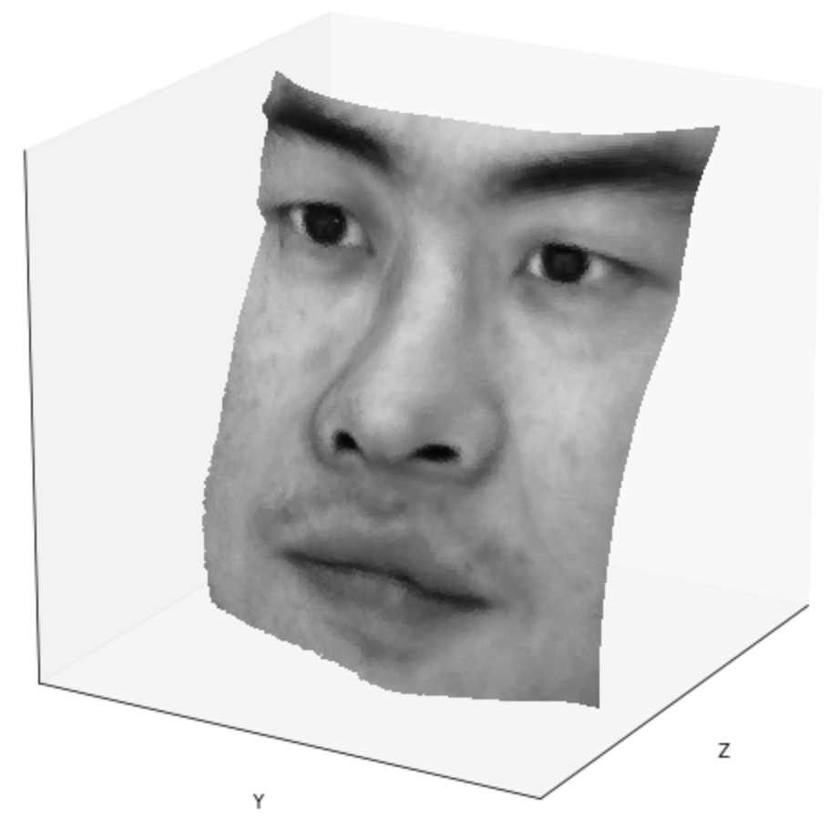 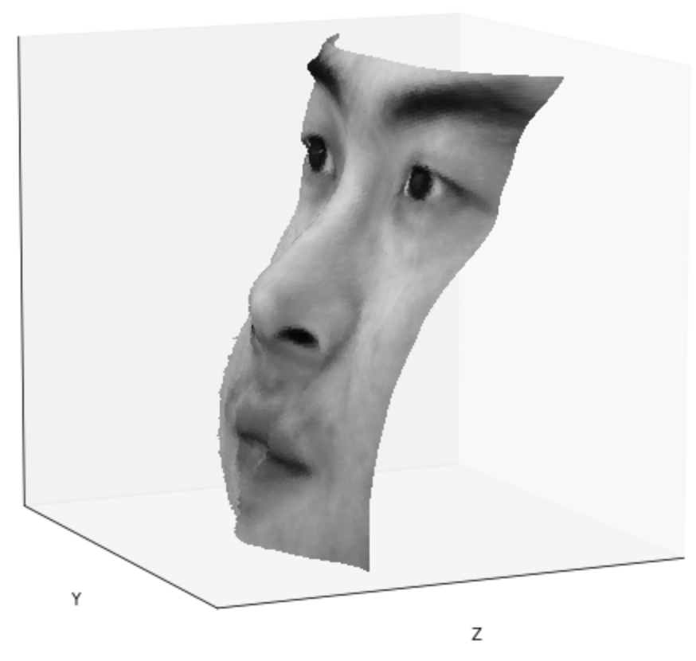                                                                          |

<div style="page-break-after: always;"></div>

### 3.3 yaleB05

The height map of this subject is not very good. The person's forehead looks strange, so does the mouth.

|                         |                                                                                                                                        Outputs                                                                                                                                       |
|:-----------------------:|:------------------------------------------------------------------------------------------------------------------------------------------------------------------------------------------------------------------------------------------------------------------------------------:|
|      Surface <br> Normal     |  <br>   |
|        Albedo <br> Map       |                                                                                                                                                            |
| Best Surface <br> Height Map |                                                                                                                                                       |


<div style="page-break-after: always;"></div>

### 3.4 yaleB07

The output for this subject looks quite good. There aren't any artifacts except the unclear edges.

|                         |                                                                                                                                        Outputs                                                                                                                                       |
|:-----------------------:|:------------------------------------------------------------------------------------------------------------------------------------------------------------------------------------------------------------------------------------------------------------------------------------:|
|      Surface <br> Normal     |  <br>   |
|        Albedo <br> Map       |                                                                                                                                                           |
| Best Surface <br> Height Map |                                                                                                                                                       |


## 4 Discussion on the Violation of the Assumptions

There are some features of the Yale Face data that violates the assumptions of the shape-from-shading method, such as

* Not a perfect Lambertian object.
* Not a perfect local shading model.
* Some images have too much shadow.
* Pictures not obtained in exactly the same object configuration.

See the below sections for examples and explanations (based on images of `yaleB05`).

### 4.1 Not a perfect Lambertian object

There should be no specular reflection for a Lambertian object which is defined to have ideal matte or diffusely reflecting surface. However, take `yaleB05` as an example, specular reflection appears very frequently.

<center>

|                                                                                                                                                                                                   Specular Reflection                                                                                                                                                                                                   |
|:-----------------------------------------------------------------------------------------------------------------------------------------------------------------------------------------------------------------------------------------------------------------------------------------------------------------------------------------------------------------------------------------------------------------------:|
|    |

</center>

### 4.2 Not a perfect local shading model

Local shading model requires that each point on a surface receives light only from sources visible at that point. In practice, this is very hard to realize. 

### 4.3 Some images have too much shadow

Some images of a subject are so dark with too much shadow which don't provide much useful infomation and might even bring more errors.

<center>

|                                                                                                                                                                                                     Too much shadow                                                                                                                                                                                                     |
|:-----------------------------------------------------------------------------------------------------------------------------------------------------------------------------------------------------------------------------------------------------------------------------------------------------------------------------------------------------------------------------------------------------------------------:|
|    |

</center>

### 4.4 Pictures not obtained in exactly the same object configuration

Sometimes the facial expression of the person will change, making the images of the same subjects cannot be perfectly aligned, and thus violates the assumption that a set of pictures of an object should be obtained in exactly the same object configuration.

See the images in section 4.1. There is also misalignment in those pictures.


## 5 Select Subsets to Improve Outputs (Possible Extra Credits)

The pictures that violate the assumptions as described in section 4 should be excluded to improve the results.

The method described in this section mainly focuses on solving the problem of **too much shadow** (see section 4.3). Take the set pictures of `yaleB02` as an example and applied the improved method to them.

**This section may apply to the general requirements as well as the extra credit (point 4).**


### 5.1 How to Select Subset
The idea to solve the above problem is to automatically choose suitable subset of pictures that excludes pictures with too much shadow. 

To implement this idea, the following method is used.

```
Go over every image in the set of pictures of yaleB02
Count the number of very drak pixels in the picture
Compute the ratio of this number over the total number of pixels
Only include this picture if the ratio is smaller than some threshold 
```


### 5.2 Implementation
The improved method to automatically select specific subset is implemented in the function `LoadFaceImages_improved()` (the original function is `LoadFaceImages()`). The algorithm is shown below:

```python
# Only choose images with less shadow.
im_sub_list = []
for fname in im_list:
    im_arr = load_image(fname)
    num_shadow = len(np.where(im_arr < 50)[0])
    ratio = num_shadow / im_arr.size
    if ratio < threshold:
        im_sub_list.append(fname)
```


### 5.3 Improved Outputs

The surface height maps produced by the original `LoadFaceImages()` function and the improved `LoadFaceImages_improved()` function are displayed in the table below.

The improvement is clear. The heights of the person's nose, chin and cheek are more realistic. The output height map also becomes brighter.

|           |                                         Original Height Map <br> by `LoadFaceImages()`                                       |                                     Improved Height Map <br>  by `LoadFaceImages_improved()`                                  |
|:---------:|:--------------------------------------------------------------------------------------------------------------------------------------:|:--------------------------------------------------------------------------------------------------------------------------------------:|
| View<br>1 |           |      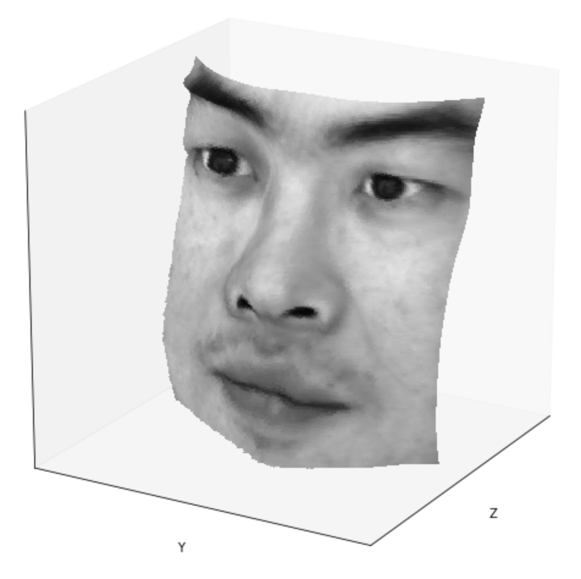     |
| View<br>2 |  | 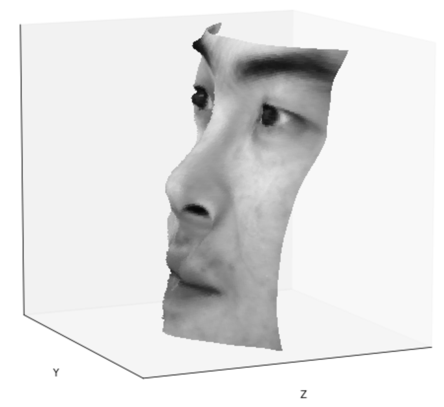 |


